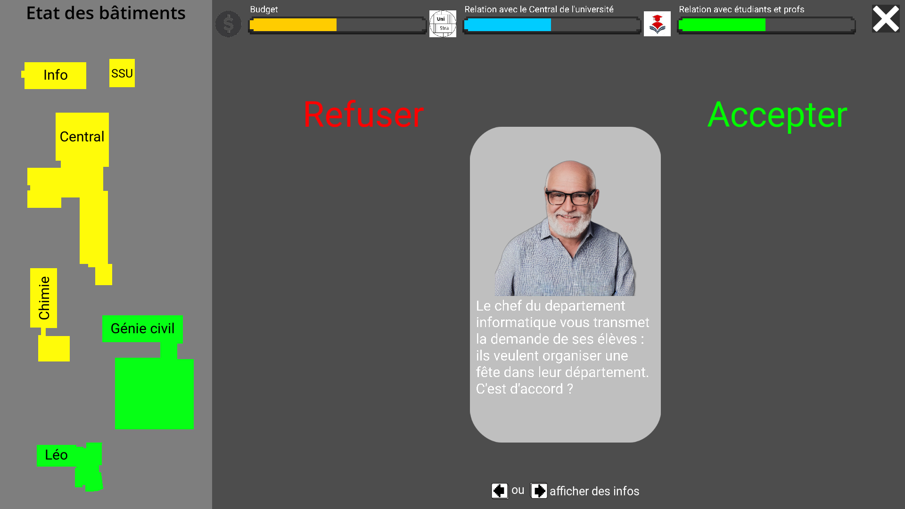

# T4

- Nom du groupe : Atomic Core
- Membres du groupe : Samuel FERNANDES | Mattéo GILLIG | Guillaume BEHR
- Liens vers les évaluations T4 :
  - **TO-DO**

## Présentation du projet

L'objectif du projet MOR24-T4-A est de concevoir un jeu sérieux visant à familiariser les utilisateurs avec un métier essentiel au personnel de l'IUT Robert Schuman.
À travers ce jeu, les joueurs doivent appréhender un concept spécifique à ce métier, une réalité quotidienne pour ceux qui l'exercent.

Dans notre jeu, nous allons présenter l'une des missions du directeur de l'IUT Robert Schuman : gérer la rénovation du campus ainsi que son budget. Cette expérience sera intégrée à travers un gameplay interactif, où les joueurs devront prendre des décisions pour maintenir à flot leur IUT et leur poste, leur permettant ainsi de se mettre à la place du directeur et de comprendre les défis auxquels il est confronté au quotidien.

### Captures d'écran

### Procédures d'installation et d'exécution

Sur le git, <https://git.unistra.fr/atomic-core/mor-24-t-4-a>, dans le dossier Executables, télécharger le fichier adapté à votre OS (Linux, Window). Trouvez où a été téléchargé le fichier et éxecutez le.

## Cahier des charges

### Objectifs pédagogiques

Les objectifs pédagogiques sont de permettre au joueur de comprendre :

- Reconnaître l'importance pour le directeur de l'IUT de s'aligner sur la politique de la centrale de l'Université de Strasbourg.
- Comprendre que le directeur de l'IUT est investi du devoir de veiller au bien-être et à la sécurité de son personnel autant que des étudiants ainsi qu'à leur réussite académique.
- Sensibiliser le joueur à la plannification sur le court et le long terme, afin de faire face aux imprévus.

#### Objectifs pédagogiques avancés

**Note aux 1ere année** : _C'est délicat de développer un jeu visitant chacun des objectifs offert par ce sujet, même si le temps qui vous ai fourni pour le projet T3 semble long ! Nous vous conseillons vivement de vous concentrer sur quelques objectifs qui vous inspirent et s'emboitent bien ensemble !_

- Appréhender les multiples défis auxquels le directeur de l'IUT est confronté en matière de gestion budgétaire.
- Comprendre comment le directeur aligne sa stratégie de développement de l'IUT en accord avec ses équipes sur le campus, le conseil d’institut qui le nomme et le ministère de l'éducation qui le supervise.
- Comprendre l'étroit lien entre les IUT et les laboratoires de recherche.
  - leur relation
  - le recrutement d'enseignant-chercheur
- Comprendre l'importance des partenariats négociés par le directeur
  - avec les médias, pour la communication
  - avec les entreprises, pour les stages et apprentissages et le financement
  - avec les instituts privées ou public (tel les mairies), pour le financement
- Définir clairement toutes les missions du directeur d'IUT
  - Administration et gestion
  - Planification stratégique
  - Gestion du personnel présent
  - Développements académiques
  - Relation publique, communication et partenariat
  - Accréditation, conformité, réglementation
  - Promouvoir la recherche et l’innovation
- Mettre en lumière l'équipe du directeur : malgré son status hiérarchique haut, il ne travaille pas seul
- Voir pourquoi et comment le directeur doit mettre en garde les futurs étudiants (sur le passage du DUT au BUT, le niveau attendu, ...) et inciter ceux susceptibles de réussir de choisir son établissement
- Examiner la façon dont le directeur établit de nouveaux programmes de formation, qu'ils concernent des départements déjà existants ou nouveaux.
- Dans le domaine spécifique de l'informatique à l'IUT, étudier comment le directeur promeut l'apprentissage de l'intelligence artificielle tout en soulignant les précautions nécessaires quant à son utilisation à travers l'IUT.

#### Références

- https://savoirs.unistra.fr/campus/les-locaux-du-departement-genie-civil-construction-durable-de-liut-robert-schuman-inaugures
- https://numero182.lactu.unistra.fr/communaute/un-nouveau-directeur-pour-liut-robert-schuman.html
- https://www.grandest.fr/actualites/de-nouveaux-locaux-pour-liut-robert-schuman/
- https://iutrs.unistra.fr/partenariats/partenaires
- https://iutrs.unistra.fr/iut/equipe/direction#:~:text=Sa%20mission%20est%20d'assurer,suivi%20des%20activit%C3%A9s%20des%20services.
- https://m.facebook.com/iut.robertschuman/videos/question-6-aujourdhui-monsieur-mos%C3%A9-nous-parle-du-r%C3%B4le-qua-la-rse-pour-luiinterv/924941238257274/

### Description des fonctionnalités

#### Simulation

Le pas de la simulation est de un mois. Une carte vaut donc un mois en terme de temps.

- Tous les batiments se degradent d'un mois ensemble.
- Chaque mois, l'état des batiment empire ou s'ameliore.

Le batiments à rénové sont : le batiment informatique, le batiment de Chimie et le batiment centrale.

- Chaque batiments à ses caractéristiques à renover : bardage, portes, fenêtres, ascenseur, chauffage, sanitaire, mur interieur.
- Chaque caractéristique à un pourcentage qui correspond à l'etat.
  - Entre 0% et 15%, la couleur est noir, la caractèristique est considérer comme insalubre et impossible à renové.
  - Entre 15% et 43%, la couleur est rouge, la caractéristique est dans une situation critique mais encore rénovable, il faut se pencher sérieusement dessus.
  - Entre 43% et 71%, la couleur est orange, l'état est encore bon mais il faut surveiller.
  - Entre 71% et 100%, la couleur est vert, l'état est excellent.
- A partir de x caractéristique dans le noir, le batiment devient de couleur noir et est donc insalubre.
- A partir de x caractéristique dans le rouge, le batiment devient de couleur rouge et est donc dans un état critique.
- A partir de x caractéristique dans l'orange, le batiment devient de couleur orange et est donc dans un bon état.
- A partir de x caractéristique dans le vert, le batiment devient de couleur vert et est donc dans un état excellent.

Chaque mois, vos actions influra sur différents aspects.

- Une barre de relation avec les étudiants et le personnel
  - Si les batiments sont rénové, les étudiants et le personnel seront satisfait.
  - Dans le cas contraire, ils seront insatisfait.
- Une barre de relation avec le centrale de l'université
  - Si vous fait des choix en contraire avec la politique de l'université, la centrale n'appreciera pas et les relations se désagrègeront.
  - Au contraire, si vous êtes en accord avec la politique, la centrale sera satisfait.
- Une barre de budget
  - Si vous n'avez pas de budget, l'IUT est en faillite et sera abandonné.
  - Dans le cas contraire, si vous avez du budget, vous pourrez rénover vos batiments et augmenté la satisfaction générale.

#### Interface

L'interface est constituée des élements suivants :

- Carte du campus avec les couleurs de l'etat des batiment
- Trois barre sur les differents indicateurs (relation étudiants/personnel, relation central, budget)
- Carte représentant l'action (une image et un dialogue)

#### Actions du joueur

Les actions du joueur sont les suivantes :

- Appuyer sur la fleche de droite pour voir les effets si la carte est accepter
- Appuyer une deuxième fois sur la fleche de droite pour accepter la carte
- Appuyer sur la fleche de gauche pour voir les effets si la carte est refusé
- Appuyer une deuxième fois sur la fleche de gauche pour refuser la carte

#### Scénarios

Scénario de victoire

- Avoir tout les batiments en vert. La renovation est terminé, l'objectif principale est remplis.

Scénario de défaite

- Avoir un batiment en noir, le batiment devient insalubre. Vous êtes viré.
- Au bout de 5 ans (60 mois donc 60 carte), le quinquennat est terminé et vous n'avez pas tout rénové.
- La relation avec les étudiants et le personnel est catastrophique. Vous avez une révolution. Vous êtes viré.
- La centrale ne vous considèrent pas comme un bon directeur, la relation la centrale et vous est catastrophique. Vous êtes viré.
- Vous n'avez plus de budget. Vous êtes viré.

### Contraintes de développement

#### Modularité

Le projet est séparer en dossier contenant chacun une fonction

- Dossier campus : scène de la carte du campus et son fichier gdscript
- Dossier decisionCard : scène de la carte qui contient l'action à décider, son fichier gdscript et le fichier svg de la carte
- Dossier endScreen : scène de l'écran de fin qui contient le message de fin de partie et son fichier gdscript 
- Dossier gauges : scène des gauges et son fichier gdscript
- Dossier manager : scène principale qui fait le lien avec tout les fonctionnalités, c'est l'écran de jeu. Son fichier gdscript ainsi qu'un fichier exitButton pour quitter l'application
- Dossier tuto : scène du tutoriel pour comprend comment jouer au jeu et son fichier gdscript

Le projet contient également un dossier ressources contenant des dossiers avec les ressources que le jeu a besoin
- Dossier cardImage : toutes les images qui seront présentent sur les cartes
- Dossier Font : les fonts utilisés, içi roboto et ses déclinaisons.
- Dossier image : images liées au fonctionnalité en générale (icon gauges, fleche pour le tuto etc...)

### Fonctionnalités et scénarios avancés

#### Fonctionnalités pris en charge par l'application actuellement

- 
- 
- 
- 

#### Fonctionnalités non pris en charge

- les cartes affectent un batiment au hasard  
- 
- 
-

