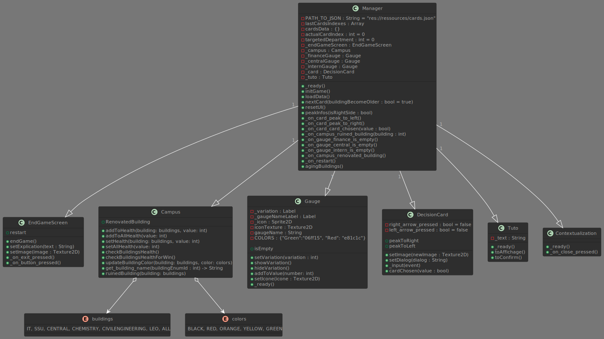

- Nom du groupe : Atomic Core
- Membres du groupe : Samuel FERNANDES | Mattéo GILLIG | Guillaume BEHR
- Liens vers les évaluations T4 :
  - [Amine Benomar](./evaluations/evaluation-Amine_Benomar.md)
  - [Maxime Lamorlette](./evaluations/evaluation-Maxime_Lamorlette.md)
  - [Titouan Fagot](./evaluations/evaluation-Titouan_Fagot.md)
  - [Julien Sauvage-Coste](./evaluations/evaluation-Julien_Sauvage-Coste.md)

## Présentation du projet

L'objectif du projet MOR24-T4-A est de concevoir un jeu sérieux visant à familiariser les utilisateurs avec un métier essentiel au personnel de l'IUT Robert Schuman.
À travers ce jeu, les joueurs doivent appréhender un concept spécifique à ce métier, une réalité quotidienne pour ceux qui l'exercent.

Dans notre jeu, nous allons présenter l'une des missions du directeur de l'IUT Robert Schuman : gérer la rénovation du campus ainsi que son budget. Cette expérience sera intégrée à travers un gameplay interactif, où les joueurs devront prendre des décisions pour maintenir à flot leur IUT et leur poste, leur permettant ainsi de se mettre à la place du directeur et de comprendre les défis auxquels il est confronté au quotidien.

### Captures d'écran

### Procédures d'installation et d'exécution

Sur le git, <https://github.com/Spidermatou/The-Schu-Man>, dans le dossier Executables, téléchargez le fichier adapté à votre OS (Linux, Windows). Trouvez où a été téléchargé le fichier et exécutez-le.

Liens de téléchargement :

- [Linux](https://gitlab.unistra.fr/atomic-core/mor-24-t-4-a/-/raw/master/The%20Schu-Man/executables/The%20Schu-Man.x86_64?ref_type=heads&inline=false) ( Une fois le jeu installé, attribuez vous les droits de l'exécuter via la commande : chmod 777 The\ Schu-Man.x86_64 )

- [Windows](https://gitlab.unistra.fr/atomic-core/mor-24-t-4-a/-/raw/master/The%20Schu-Man/executables/The%20Schu-Man.exe?ref_type=heads&inline=false)

## Cahier des charges

### Objectifs pédagogiques

Les objectifs pédagogiques sont de permettre au joueur de comprendre :

- Reconnaître l'importance pour le directeur de l'IUT de s'aligner sur la politique de la centrale de l'Université de Strasbourg.
- Comprendre que le directeur de l'IUT est investi du devoir de veiller au bien-être et à la sécurité de son personnel autant que des étudiants ainsi qu'à leur réussite académique.
- Sensibiliser le joueur à la planification sur le court et le long terme, afin de faire face aux imprévus.

#### Objectifs pédagogiques avancés

**Note aux 1ère année** : _C'est délicat de développer un jeu visitant chacun des objectifs offerts par ce sujet, même si le temps qui vous est fourni pour le projet T3 semble long ! Nous vous conseillons vivement de vous concentrer sur quelques objectifs qui vous inspirent et s'emboîtent bien ensemble !_

- Appréhender les multiples défis auxquels le directeur de l'IUT est confronté en matière de gestion budgétaire.
- Comprendre comment le directeur aligne sa stratégie de développement de l'IUT en accord avec ses équipes sur le campus, le conseil d’institut qui le nomme et le ministère de l'éducation qui le supervise.
- Comprendre l'étroit lien entre les IUT et les laboratoires de recherche.
  - leur relation
  - le recrutement d'enseignant-chercheur
- Comprendre l'importance des partenariats négociés par le directeur
  - avec les médias, pour la communication
  - avec les entreprises, pour les stages et apprentissages et le financement
  - avec les instituts privés ou publics (tels les mairies), pour le financement
- Définir clairement toutes les missions du directeur d'IUT
  - Administration et gestion
  - Planification stratégique
  - Gestion du personnel présent
  - Développements académiques
  - Relation publique, communication et partenariat
  - Accréditation, conformité, réglementation
  - Promouvoir la recherche et l’innovation
- Mettre en lumière l'équipe du directeur : malgré son statut hiérarchique élevé, il ne travaille pas seul
- Voir pourquoi et comment le directeur doit mettre en garde les futurs étudiants (sur le passage du DUT au BUT, le niveau attendu, ...) et inciter ceux susceptibles de réussir à choisir son établissement
- Examiner la façon dont le directeur établit de nouveaux programmes de formation, qu'ils concernent des départements déjà existants ou nouveaux.
- Dans le domaine spécifique de l'informatique à l'IUT, étudier comment le directeur promeut l'apprentissage de l'intelligence artificielle tout en soulignant les précautions nécessaires quant à son utilisation à travers l'IUT.

#### Références

- https://savoirs.unistra.fr/campus/les-locaux-du-departement-genie-civil-construction-durable-de-liut-robert-schuman-inaugures
- https://numero182.lactu.unistra.fr/communaute/un-nouveau-directeur-pour-liut-robert-schuman.html
- https://www.grandest.fr/actualites/de-nouveaux-locaux-pour-liut-robert-schuman/
- https://iutrs.unistra.fr/partenariats/partenaires
- https://iutrs.unistra.fr/iut/equipe/direction#:~:text=Sa%20mission%20est%20d'assurer,suivi%20des%20activités%20des%20services.
- https://m.facebook.com/iut.robertschuman/videos/question-6-aujourdhui-monsieur-mos%C3%A9-nous-parle-du-r%C3%B4le-qua-la-rse-pour-luiinterv/924941238257274/

### Description des fonctionnalités

#### Simulation

Le pas de la simulation est d'un mois. Une carte vaut donc un mois en termes de

temps.

- Tous les bâtiments se dégradent d'un mois ensemble.
- Chaque mois, l'état des bâtiments empire ou s'améliore.

Les bâtiments à rénover sont : le bâtiment informatique, le bâtiment de Chimie et le bâtiment central.

- Chaque bâtiment a ses caractéristiques à rénover : bardage, portes, fenêtres, ascenseur, chauffage, sanitaire, mur intérieur.
- Chaque caractéristique a un pourcentage qui correspond à l'état.
  - Entre 0% et 15%, la couleur est noire, la caractéristique est considérée comme insalubre et impossible à rénover.
  - Entre 15% et 43%, la couleur est rouge, la caractéristique est dans une situation critique mais encore rénovable, il faut se pencher sérieusement dessus.
  - Entre 43% et 71%, la couleur est orange, l'état est encore bon mais il faut surveiller.
  - Entre 71% et 100%, la couleur est verte, l'état est excellent.
- À partir de x caractéristiques dans le noir, le bâtiment devient de couleur noire et est donc insalubre.
- À partir de x caractéristiques dans le rouge, le bâtiment devient de couleur rouge et est donc dans un état critique.
- À partir de x caractéristiques dans l'orange, le bâtiment devient de couleur orange et est donc dans un bon état.
- À partir de x caractéristiques dans le vert, le bâtiment devient de couleur verte et est donc dans un état excellent.

Chaque mois, vos actions influent sur différents aspects.

- Une barre de relation avec les étudiants et le personnel
  - Si les bâtiments sont rénovés, les étudiants et le personnel seront satisfaits.
  - Dans le cas contraire, ils seront insatisfaits.
- Une barre de relation avec la centrale de l'université
  - Si vous faites des choix contraires à la politique de l'université, la centrale n'appréciera pas et les relations se désagrégeront.
  - Au contraire, si vous êtes en accord avec la politique, la centrale sera satisfaite.
- Une barre de budget
  - Si vous n'avez pas de budget, l'IUT est en faillite et sera abandonné.
  - Dans le cas contraire, si vous avez du budget, vous pourrez rénover vos bâtiments et augmenter la satisfaction générale.

#### Interface

L'interface est constituée des éléments suivants :

- Carte du campus avec les couleurs de l'état des bâtiments
- Trois barres sur les différents indicateurs (relation étudiants/personnel, relation centrale, budget)
- Carte représentant l'action (une image et un dialogue)

#### Actions du joueur

Les actions du joueur sont les suivantes :

- Appuyer sur la flèche de droite pour voir les effets si la carte est acceptée
- Appuyer une deuxième fois sur la flèche de droite pour accepter la carte
- Appuyer sur la flèche de gauche pour voir les effets si la carte est refusée
- Appuyer une deuxième fois sur la flèche de gauche pour refuser la carte

#### Scénarios

Scénario de victoire

- Avoir tous les bâtiments en vert. La rénovation est terminée, l'objectif principal est rempli.

Scénario de défaite

- Avoir un bâtiment en noir, le bâtiment devient insalubre. Vous êtes viré.
- Au bout de 5 ans (60 mois donc 60 cartes), le quinquennat est terminé et vous n'avez pas tout rénové.
- La relation avec les étudiants et le personnel est catastrophique. Vous avez une révolution. Vous êtes viré.
- La centrale ne vous considère pas comme un bon directeur, la relation avec la centrale et vous est catastrophique. Vous êtes viré.
- Vous n'avez plus de budget. Vous êtes viré.

### Contraintes de développement

Pour permettre à un maximum de joueurs d'avoir la possibilité de jouer, nous avons un jeu multiplateforme, il est disponible sur :

- Linux (toute distribution)
- Windows (10 et 11)

#### Modularité

Le projet est séparé en dossiers contenant chacun une fonction

- Dossier campus : scène de la carte du campus et son fichier gdscript
- Dossier decisionCard : scène de la carte qui contient l'action à décider, son fichier gdscript et le fichier svg de la carte
- Dossier endScreen : scène de l'écran de fin qui contient le message de fin de partie et son fichier gdscript
- Dossier gauges : scène des jauges et son fichier gdscript
- Dossier manager : scène principale qui fait le lien avec toutes les fonctionnalités, c'est l'écran de jeu. Son fichier gdscript ainsi qu'un fichier exitButton pour quitter l'application
- Dossier tuto : scène du tutoriel pour comprendre comment jouer au jeu et son fichier gdscript

Le projet contient également un dossier ressources contenant des dossiers avec les ressources que le jeu a besoin

- Dossier cardImage : toutes les images qui seront présentes sur les cartes
- Dossier Font : les polices utilisées, ici roboto et ses déclinaisons.
- Dossier image : images liées aux fonctionnalités en général (icon gauges, flèche pour le tuto etc...)

### Fonctionnalités et scénarios avancés

#### Fonctionnalités prises en charge par l'application actuellement

- Les cartes affectent un bâtiment au hasard : une carte de rénovation peut affecter un bâtiment choisi au hasard
- Les cartes affectent un ou des bâtiments ciblés : une carte de rénovation totale
- Les cartes affectent les jauges : Proposition de la mairie pour subventionner l'IUT
- Les cartes sont tirées au hasard
- Un petit tutoriel permettant de comprendre comment jouer
- Diverses fins possibles

#### Fonctionnalités non prises en charge

- À partir d'un certain pourcentage de relation, certaines cartes se débloquent
- Les bâtiments ont des caractéristiques avec un pourcentage propre à eux (portes, fenêtres, bardage ...)
- Des cartes événementielles (Pandémie, vague de froid, incendie)
- Gestion des relations avec les entreprises et médias
- Gestion des apprentis pour gagner de l'argent constamment
